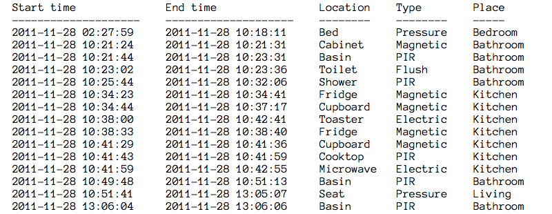
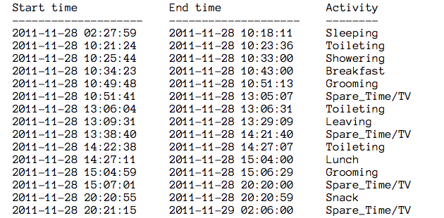

## repodepo

Exam project: Modelli Probabilistici per le Decisioni (2015/16) - University of Milan Bicocca

Based on article:

Sensors 2013, 13, 5460-5477; doi:10.3390/s130505460

**Activity Recognition Using Hybrid Generative/Discriminative Models on Home Environments Using Binary Sensors**

Fco. Javier Ordónez, Paula de Toledo and Araceli Sanchis

Computer Science Department, University Carlos III of Madrid, Leganés, Madrid 28911, Spain; 

Published: 24 April 2013

**Abstract:** Activities of daily living are good indicators of elderly health status, and activity recognition in smart environments is a well-known problem that has been previously addressed by several studies. In this paper, we describe the use of two powerful machine learning schemes, ANN (Artificial Neural Network) and SVM (Support Vector Machines), within the framework of HMM (Hidden Markov Model) in order to tackle the task of activity recognition in a home setting. The output scores of the discriminative models, after processing, are used as observation probabilities of the hybrid approach. We evaluate our approach by comparing these hybrid models with other classical activity recognition methods using five real datasets. We show how the hybrid models achieve significantly better recognition performance, with significance level p < 0.05, proving that the hybrid approach is better suited for the addressed domain.

#### Project purposes

- Definitions of data structure
- HMM model
- infer the user's activity from sensor data
- data analysis

#### Project Report (ita)

##### Introduzione
L'invecchiamento della popolazione ha un impatto sempre più significativo sul sistema sanitario. Per questo si cercano vie più efficienti per portare assistenza in casa delle persone bisognose, in particolare gli anziani, il cui numero secondo le stime é in costante aumento grazie alle migliori condizioni di vita e di cure.

Monitorare le attività umane (ADL) è diventato un aspetto fondamentale per costruire un ambiente intelligente atto a garantire il benessere in grado di aumentare sia la sicurezza, sia l'autonomia dei soggetti.

Uno degli approcci più promettenti ed economici è il monitoraggio delle attività tramite una rete wireless di sensori (WSN) disposti nell'ambiente abitativo, in quanto molto flessibile e di facile sviluppo.
Sono stati sviluppati parecchi modelli che utilizzano sensori per monitorare le attività ADL, come ad esempio *Reti Bayesiane* o 8Conditional Random Fields8. In particolare, si è notato che *Hidden Markov Model (HMM)*} è un modello performante in questo dominio applicativo; alcuni articoli approfondiscono il modello proponendo soluzioni di HMM ibridi, noi invece abbiamo implementato una versione classica.

##### I sensori
Per costruire e testare il modello, sono stati utilizzati dataset presi da due appartamenti. Ogni appartamento fornisce due dataset: il primo con le rilevazioni generate dai sensori, il secondo con le attività rilevate dai sensori.
I sensori utilizzati sono stati di vario tipo (magnetici, a pressione, elettrici etc), disposti in più zone della casa in maniera il meno invasiva possibile e hanno registrato e salvato i dati per diversi intervalli di tempo (due settimane circa).

`Start time - End time - Location - Type - Place`

dove la tripla `Location-Type-Place` indica il sensore che ha effettuato la rilevazione. Nel dataset delle attivita ogni riga contiene l’intervallo di tempo e il nome dell’attivita rilevata. Ogni attivita è strettamente legata alla rilevazione effettuata dai sensori, ed è rappresentata su una riga come:

`Start time - End time - Activity`



##### HMM

Un HMM (Hidden Markov Model) è un modello probabilistico definito da variabili os- servabili xt e variabili nascoste yt, dove t indica il tempo. In questo caso le variabili osservabili sono i sensori, mentre le variabili nascoste sono le attività e dipendono come in figura.
 
In un HMM standard le variabili nascoste yt (y al tempo t) dipendono solo dallo stato delle variabili yt 1 (y al tempo t − 1), mentre le variabili osservabili xt (x al tempo t) dipendono solo dallo stato delle variabili yt (y allo stesso istante t).



Necessari in un HMM sono:

-  i dati relativi a p(y), ovvero la probabilità a priori delle variabili y; 
- p(yt∣yt − 1) le probabilità di transizione da uno stato y al successivo; 
- p(xt∣yt) le probabilità di una variabile xt data yt.

##### Il Software

Il software è stato sviluppato in Python, e permette di creare un HMM partendo da una sequenza di rilevazioni prese dal dataset di un appartamento.
Si è deciso di trasformare le rilevazioni dal formato testuale fornito `.txt` in un formato più compatto ed ordinato, il csv. Come verrà spiegato dettagliatamente nei successivi paragrafi, il software analizza i sorgenti del dataset e calcola le probabilità iniziali, di transizione degli stati e di emissione degli eventi in base alle occorrenze all’interno del file. Successivamente, il software si avvale di 2 librerie gratutite di nome `GHMM` e `Pomegranate`, in grado di creare modelli HMM e molte altre funzionalità, tra cui l’utilizzo dell’algoritmo di Viterbi.
Con GHMM è stato possibile solo costrutire il modello HMM, mentre con Pomegranate si è utilizzato l’algoritmo di Viterbi ed è stato possibile fare considerazioni sul modello creato. Entrambi i modelli vengono pero` salvati in appositi file di testo generati a runtime.

##### Le librerie 

###### GHMM

GHMM (General Hidden Markov Model) è una libreria gratuita, disponibile sotto licenza LGPL (GNU Lesser General Public License), scritta in C, ma disponibile in Python grazie a un wrapper che funge da interfaccia. Essa è in grado di costruire modelli base o estesi HMM con emissioni discrete o continue.
E ́ disponibile all’indirizzo `http://ghmm.org/` ed è sotto la supervisione del gruppo di ricerca di Alexander Schliep presso l’Università di Rutgers. Ha inoltre a disposizione una sezione all’indirizzo `http://sourceforge.net/projects/ghmm/` dove è possibile scrivere su un forum per eventuali richieste.
Presenta però due svantaggi:

- Non è frequentemente aggiornata e supportata (ultimo update 09/2015)
- E ́ facilmente installabile sono in ambiente Unix, in particolare sulla distibuzione Ubuntu; in ambiente OSX è molto complesso installarla a causa di diversi errori in fase di compilazione del sorgente in C; in ambiente Windows non è per niente supportata, ma solo disponibile attraverso l’utilizzo di Cygwin.

Per generare un HMM
`model = HMMFromMatrices(sigma, DiscreteDistribution(sigma), t adls, o sens adls, p adls)`
con il dizionario delle emissioni sigma
`sigma = IntegerRange(0, len(list sens))`
e con t adls matrice delle transizioni, o sens adls matrice delle osservazioni e p adls lista delle probabilità a priori delle variabili nascoste.

###### Pomegranate

Pomegranate è una libreria per Python, implementata in Cython (un compilatore C per Python), nata dal pre-esistente, e non piu ́ supportato, progetto YAHMM, che permette la gestione di reti Bayesiane, Catene di Markov, HMM, Macchine a stati finiti e altro ancora.
E ́ disponibile la documentazione ben aggiornata all’indirizzo `http://pomegranate.readthedocs.io/en/latest/` ed è facilemnte installabile tramite il pacchetto pip eseguendo da terminale `pip install pomegranate`. Per generare un HMM `model = HiddenMarkovModel( name="Model-name" )`

Il package caratterizza ogni stato nascosto e le sue emissioni con la seguente sintassi:
    `ADL1 = State( DiscreteDistribution( ’sens1’:  0.1, ’sens2’:  0.4, ’sens3’:  0.5 ), name=’ADL1’ )`
 
Dopodichè, è necessario definire le probabilità iniziali come segue: `model.add transition( model.start, ADL1, 0.6 )` e le probabilità di transizione tra gli stati nel seguente modo:
`model.add transition( ADL1, ADL2, 0.65 )`
Successivamente, dopo la chiamata `model.bake()` che permette l’effettiva elaborazione dei dati forniti per la creazione del HMM, è possibile fare diversi tipi di inferenze sul modello. Come forward,backward, forward-backward e Viterbi.

##### Le funzioni

Di seguito sono descritte le funzioni principali del software, in modo da illustrare det- tagliatamente il metodo usato per creare le probabilità utilizzate per la creazione del modello.


- `check and generate csv` Prende in input il path di un file testuale .txt ed esamina riga per riga (evitando le prime due che nel dataset fornito sono di intesazione) e per ognuna verifica che lo Start time sia antecedente al End time; sono stati anche implementati, ma non funzionanti, i controlli tra gli Start time e End time tra righe consecutive. Se non sono presenti errori genera un file .csv con i dati controllati, altrimenti lancia un messaggio di errore che indica in quale righe sono state rilevate incorrettezze.
Questo controllo ci ha permesso di scoprire un errore nel file originale rispetto alcuni Start e End time



- `normalize list e normalize matrix` 
Queste funzioni prendono in input rispettivamente liste e matrici e normalizzano i dati contenuti, utilizzando la divisione fornita della libreria numpy. In questo modo ogni lista e ogni riga della matrice ha come somma 1.0.
        
- `csv list e csv matrix` 
Come facilmente intuibile, generano file in formato .csv a partire dai dati in input: lista dei nomi delle variabili (su righe e colonne per la matrice) e lista (o matrice) dei valori da inserire.

- `obtain p adls`
Permette di ricavare la lista delle attività rilevate, le probabilità iniziali di ogni singola attività e la sequenza di attività presente nel dataset. Questa funzione prende in input il percorso del file csv contenente le attività da analizzare e semplicemente conta le occorrenze di ciascuna stessa attività all’interno del file incrementando un contatore ad ogni rilevazione, dopodichè normalizza i dati.
- `obtain t adls`
Permette di ricavare la matrice delle transizioni per le ADLs. Conta, ogni volta che un attività accade al tempo t, quante volte ogni singola attività compare al tempo t − 1, in modo da generare una matrice n × n con la somma, per ogni attività, delle volte che le altre attività sono accadute successivamente. Infine normalizza i dati.
- `obtain list sens`
A partire dal file in input ricava la lista dei sensori attivati durante le rilevazioni (composti dalla tripla univoca Location-Type-Place) e la sequenza con cui sono stati attivati.
- `obtain o sens adls`
La funzione permette di ricavare le probabilità di emissione dalle ADLs ai sensori. Viene tenuto conto di tutte le volte che l’intervallo di tempo di una rilevazione del sensore cade all’interno della rilevazione di un’attività. La matrice ottenuta è poi normalizzata.

##### Esecuzione e stime

Da ogni dataset vengono calcolate le matrici di transizione degli stati nascosti, di osser- vazione e le probabilità a priori e dati in pasto alla libreria pomegrante, la quale genera il modello come descritto in precedenza.
Una volta generato il nostro modello, utilizzeremo l’algoritmo di Viterbi con il comando
`model.viterbi(sequence)`
dove sequence è la sequenza di sensori fornita dal dataset.
           
Esso genera la sequenza di attività ottima generata in base alla sequence inserita; in questo modo possiamo verificare se la sequenza di ADLs risultante è coerente con quella della fornita dal dataset originale.

##### Parametri di affidabilità

Per ricavare informazioni dal confronto tra la sequenza di attività orginale (che chiamia- mo per semplicità seq1) e quella generata a partire dal modello HMM (che chiamiamo seq2) abbiamo implementato tre differenti metodi.

- `diff base`
Calcola un rate in base alla differenza punto-a-punto tra le due sequenze inserite; il punteggio ideale è prossimo allo zero, poichè:
	-  inizializzo un contatore di diff a zero
	-  ogni volta che le ADLs tra le due sequenze alla stessa posizione non sono uguali
incremento di 1 un contatore
	- calcolo il rapporto tra il numero di diff e la lunghezza della sequenza di riferimento
seq1

quindi più il rapporto è vicino allo zero, meno sono le differenze punto-a-punto tra le due sequenze.

- `diff A`
Assegna un rate in base all’uguaglianza o meno tra un’attività al passo x di seq1 e l’intervallo attorno al passo x di seq2.
	- inizializzo un contatore di diff a zero
	- ogni volta confronto la ADL in posizione x di seq1 con le ADL nell’intervallo attorno
  a x in seq2
	- assegno un punteggio alla distanza dal centro dell’intervallo (0 se il match è in
posizione x, 1 se il match è in x+1 o x−1 e così via
	- calcolo il rapporto tra il rate ottenuto e la lunghezza della sequenza di riferimento
seq1
Più il rapporto è prossimo allo zero, migliore è la somiglianza tra le due sequenze.
- `diff B`
 Assegna un rate in base allo scostamento dei match tra le due sequenze;
	- ad ogni passo confronto la ADL in x della seq1 e scorro la seq2 fino a quando non
trovo un match in y
	- il passo successivo cerca il match tra x + 1 della seq1 a partire da y + 1 della seq2
	- calcolo il rapporto tra la lunghezza della sequenza di riferimento seq1 con il punto di arrivo in seq2

Più il rapporto è vicino ad 1 e più le due sequenze sono simili e intervallate da poche differenze.

##### Conclusioni e sviluppi futuri

Le analisi sono fatte su ogni singolo dataset (ovvero appartamento) fornito e dai risultati ottenuti si pùo dire che:

- a partire dal modello costruito su OrdonezA, si ottiene una sequenza di attività abbastanza diversa putno-a-punto da quella originale, ma con poche differenze se si considerano gli intorni e la sequenza complessiva scartando eventuali dati sporchi 


- a partire dal modello costruito su OrdonezB, si ottiene una sequenza di attività ancora più differente putno-a-punto da quella originale, ma con poche differenze se si considerano gli intorni e ancora meno se si considera la sequenza complessiva scartando i dati sporchi 



Per migliorare i risultati potrebbe essere interessante approfondire l’associazione tra ri- levazioni sensoristiche ravvicinate e simili, che sono identificate da un’unica attività. Si nota infatti che la nostra sequenza di ADLs generata con l’algoritmo di Viterbi, nono- stante venga ripulita da ripetizioni di attività non significative, si presenta comunque non più lunga rispetto alla sequenza originale, proprio perchè va a generare un attività a partire da ogni rilevazione da sensore, a differenza dell’output fornito dal dataset. Sarebbe anche interessate integrare con tool grafici disponibili con la libreria Pomegranate per poter indagare anche ad occhio nudo i procedimenti dell’algoritmo.
Un altra possibilità, avendo a disposizione un dataset di maggiori dimensioni, potrebbe essere di indagare l’attendibilità di previzione di ADLs non solo per ogni appartamento singolo, ma per un insieme di appartamenti, e magari inferire eventuali differenze.